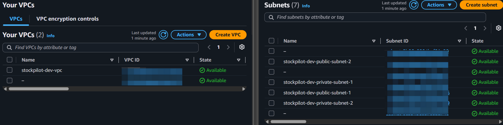
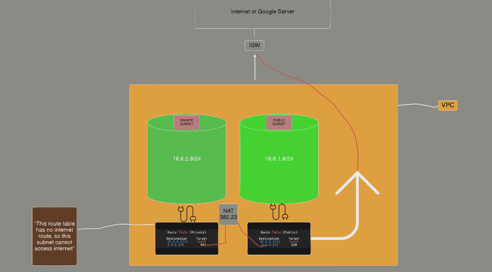
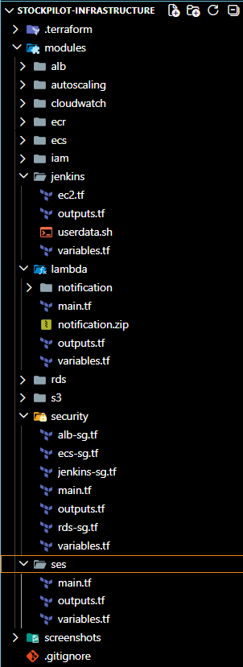
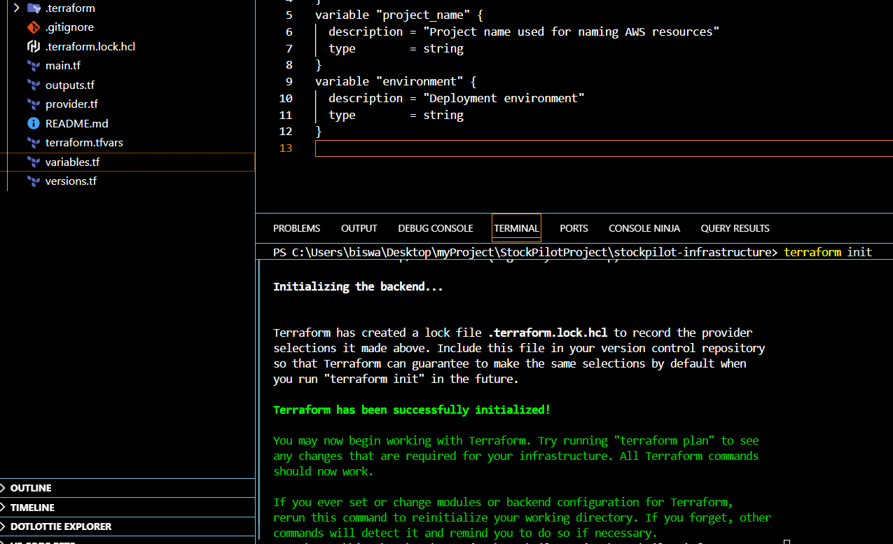
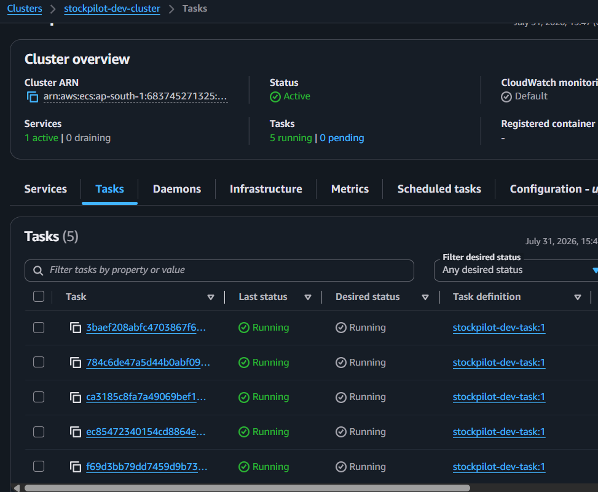
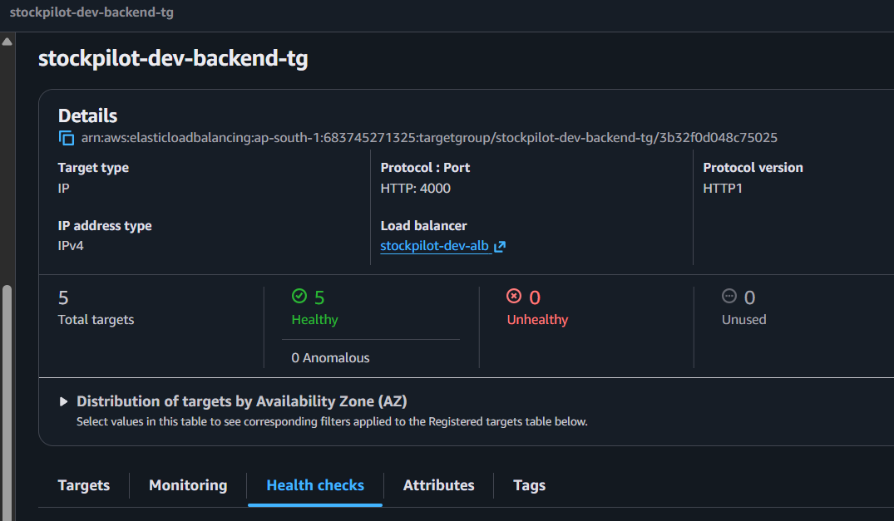
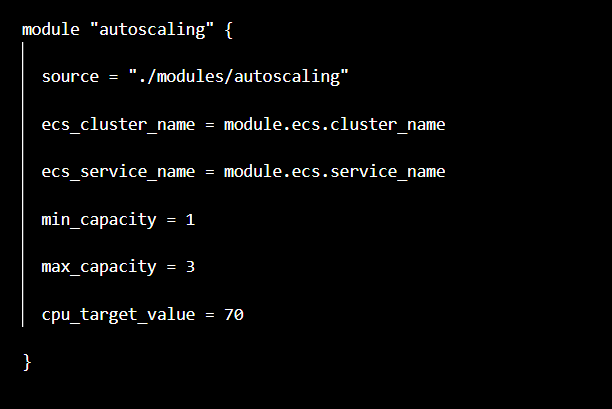
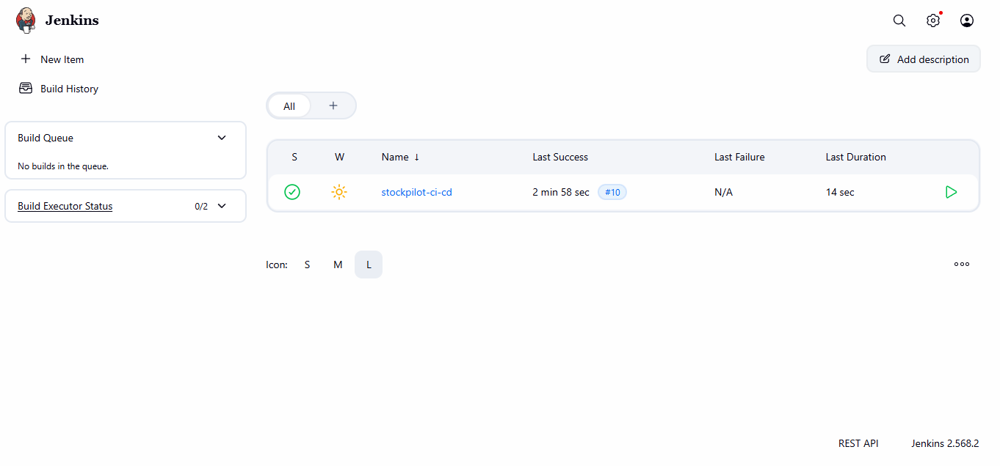
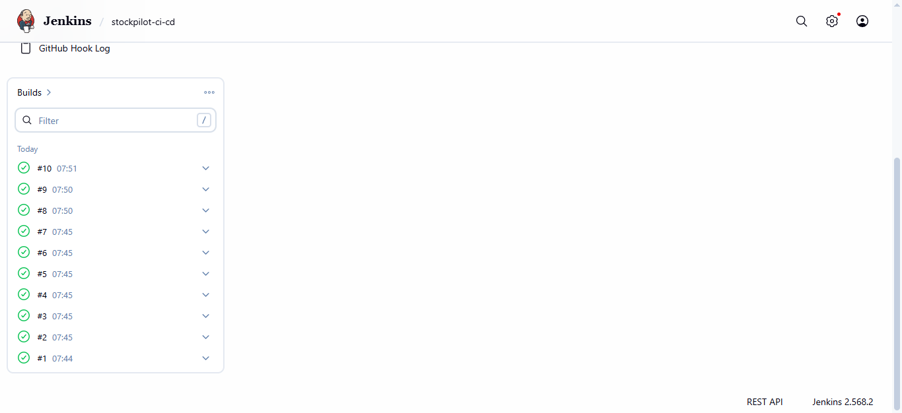

# StockPilot Infrastructure

Terraform-based Infrastructure as Code (IaC) project for the StockPilot application.

This repository contains the AWS infrastructure, networking, containerization, CI/CD, serverless notification system, and AI integration used for the StockPilot inventory management application.

---

## 📌 Project Overview

StockPilot is an inventory management application designed to manage:

- Authentication
- Categories
- Products
- Inventory
- Transactions
- Low-stock products
- AI-powered assistance

The cloud infrastructure is provisioned and managed using **Terraform**, while **Jenkins** is used to automate the application CI/CD process.

The project includes:

- Infrastructure as Code using Terraform
- AWS VPC networking
- Public and private subnets
- IAM roles and policies
- Docker containerization
- Amazon ECR
- Amazon ECS Fargate
- Application Load Balancer
- Amazon RDS PostgreSQL
- Amazon S3
- Amazon CloudWatch
- ECS Auto Scaling
- Jenkins CI/CD
- GitHub Webhooks
- AWS Lambda
- Amazon SES
- Amazon Bedrock
- AI chatbot integration
- Automated ECS deployment

---

# 🏗️ Architecture

The overall StockPilot architecture combines AWS networking, containerized application deployment, CI/CD automation, serverless processing, email notifications, and generative AI.

```text
                         ┌─────────────────┐
                         │     GitHub      │
                         └────────┬────────┘
                                  │
                               Webhook
                                  │
                                  ▼
                         ┌─────────────────┐
                         │     Jenkins     │
                         │      EC2        │
                         └────────┬────────┘
                                  │
                             Docker Build
                                  │
                                  ▼
                         ┌─────────────────┐
                         │   Amazon ECR    │
                         └────────┬────────┘
                                  │
                              New Image
                                  │
                                  ▼
                         ┌─────────────────┐
                         │ Amazon ECS      │
                         │    Fargate      │
                         └────────┬────────┘
                                  │
                                  ▼
                         ┌─────────────────┐
                         │      ALB        │
                         └────────┬────────┘
                                  │
                                  ▼
                         ┌─────────────────┐
                         │ StockPilot API  │
                         │ Node.js Backend │
                         └──────┬─────┬────┘
                                │     │
                    ┌───────────┘     └──────────────┐
                    ▼                                ▼
             ┌─────────────┐                  ┌──────────────┐
             │ PostgreSQL  │                  │   Amazon S3  │
             │    RDS      │                  │   Storage    │
             └─────────────┘                  └──────────────┘
```

---

# ☁️ AWS Services Used

| AWS Service | Purpose |
|---|---|
| Amazon VPC | Network infrastructure |
| Public Subnets | Public-facing resources |
| Private Subnets | ECS and database resources |
| Internet Gateway | Internet connectivity for public resources |
| NAT Gateway | Outbound connectivity for private resources |
| Elastic IP | Public IP associated with NAT Gateway |
| Route Tables | Network routing |
| Security Groups | Network access control |
| IAM | Roles and permissions |
| Amazon EC2 | Jenkins server |
| Jenkins | CI/CD automation |
| Amazon ECR | Docker image registry |
| Amazon ECS Fargate | Container deployment |
| Application Load Balancer | Traffic distribution |
| Amazon RDS PostgreSQL | Application database |
| Amazon S3 | Application storage |
| Amazon CloudWatch | Container logging |
| ECS Auto Scaling | Automatic task scaling |
| AWS Lambda | Serverless low-stock processing |
| Amazon SES | Low-stock email notifications |
| Amazon Bedrock | AI chatbot |

---

# 🌐 VPC and Networking

The application infrastructure is deployed inside an Amazon VPC.

The VPC architecture contains:

- Public subnets
- Private subnets
- Internet Gateway
- NAT Gateway
- Elastic IP
- Public route tables
- Private route tables
- Security groups

The architecture separates public-facing resources from private application and database resources.

## Network Flow

```text
                         Internet
                            │
                            ▼
                    Internet Gateway
                            │
              ┌─────────────┴─────────────┐
              │                           │
              ▼                           ▼
       Public Subnet 1              Public Subnet 2
              │                           │
              │                           │
         Jenkins EC2                  ALB
                                          │
                                          ▼
                               Private Subnets
                                  │         │
                                  ▼         ▼
                                 ECS       RDS
```

## VPC and Subnets



## VPC, Subnet and Route Table Architecture



---

# 🔐 Security Groups

Separate security groups are used for different infrastructure components.

The project includes security groups for:

- Jenkins
- Application Load Balancer
- ECS
- RDS

The security groups control communication between the different application layers.

Example traffic flow:

```text
Internet
   │
   ▼
ALB :80
   │
   ▼
ECS :4000
   │
   ▼
RDS PostgreSQL :5432
```

---

# 🧱 Infrastructure as Code

Terraform is used to provision and manage the AWS infrastructure.

Instead of manually creating AWS resources through the AWS Management Console, the infrastructure is defined as Terraform configuration.

This provides:

- Repeatable infrastructure
- Version-controlled infrastructure
- Automated provisioning
- Modular infrastructure
- Easier infrastructure management
- Consistent environments

---

# 📁 Terraform Project Structure

```text
stockpilot-infrastructure/
│
├── main.tf
├── variables.tf
├── outputs.tf
├── locals.tf
├── provider.tf
├── terraform.tfvars
│
├── modules/
│   │
│   ├── security/
│   ├── iam/
│   ├── rds/
│   ├── alb/
│   ├── ecr/
│   ├── ecs/
│   ├── autoscaling/
│   ├── cloudwatch/
│   ├── s3/
│   └── jenkins/
│
├── screenshots/
│   ├── autoscaling_Module.png
│   ├── ecs_task.png
│   ├── jenkins_buildnow.png
│   ├── jenkins_interface.png
│   ├── loadBalancer_targetGroup.png
│   ├── modulesFolder_structure.png
│   ├── terraform_init.png
│   ├── vpc_subnet_routeTable_diagram.png
│   └── vpc-subnet.png
│
├── .gitignore
└── README.md
```

---

# 🧩 Terraform Modules

The infrastructure is divided into reusable Terraform modules.

| Module | Responsibility |
|---|---|
| `security` | Security groups and security rules |
| `iam` | IAM roles, policies and instance profiles |
| `rds` | PostgreSQL RDS infrastructure |
| `alb` | Application Load Balancer and Target Group |
| `ecr` | Amazon ECR repository |
| `ecs` | ECS Cluster, Service and Task Definition |
| `autoscaling` | ECS service auto scaling |
| `cloudwatch` | CloudWatch log group |
| `s3` | S3 bucket and configuration |
| `jenkins` | Jenkins EC2 server |

## Terraform Module Structure



---

# 🚀 Terraform Workflow

The Terraform workflow follows:

```text
Terraform Configuration
        │
        ▼
terraform init
        │
        ▼
terraform fmt
        │
        ▼
terraform validate
        │
        ▼
terraform plan
        │
        ▼
terraform apply
        │
        ▼
AWS Infrastructure
```

---

# ⚙️ Terraform Commands

## Initialize Terraform

```bash
terraform init
```

This initializes Terraform and downloads the required providers and modules.



---

## Format Terraform Files

```bash
terraform fmt -recursive
```

This formats Terraform configuration files according to Terraform's standard formatting.

---

## Validate Terraform Configuration

```bash
terraform validate
```

This checks whether the Terraform configuration is syntactically valid.

---

## Create Terraform Plan

```bash
terraform plan
```

This displays the changes Terraform intends to make before modifying AWS resources.

---

## Apply Infrastructure

```bash
terraform apply
```

This creates or updates the AWS resources defined in the Terraform configuration.

---

## Destroy Infrastructure

```bash
terraform destroy
```

This destroys resources managed by Terraform.

> Always review the resources carefully before running `terraform destroy`.

---

# 🐳 Docker

The StockPilot backend is containerized using Docker.

The Docker image is built from the application's Dockerfile and then pushed to Amazon ECR.

```text
StockPilot Backend
       │
       ▼
Dockerfile
       │
       ▼
Docker Image
       │
       ▼
Amazon ECR
```

---

# 📦 Amazon ECR

Amazon Elastic Container Registry is used as the Docker image registry.

The Jenkins pipeline builds the StockPilot backend Docker image and pushes the image to the ECR repository.

```text
GitHub
   │
   ▼
Jenkins
   │
   ▼
Docker Build
   │
   ▼
Amazon ECR
```

---

# 🚢 Amazon ECS Fargate

The StockPilot backend is deployed using Amazon ECS with Fargate.

Terraform manages:

- ECS Cluster
- ECS Task Definition
- ECS Service
- IAM Execution Role
- IAM Task Role
- Container configuration
- CloudWatch logging
- Network configuration

## ECS Task Definition



The StockPilot backend container runs on port:

```text
4000
```

---

# ⚖️ Application Load Balancer

The Application Load Balancer provides the public entry point for the StockPilot backend.

Traffic flows through:

```text
Client
   │
   ▼
Application Load Balancer
   │
   ▼
Target Group
   │
   ▼
ECS Task
   │
   ▼
StockPilot Backend :4000
```

## Load Balancer and Target Group



---

# 📈 ECS Auto Scaling

ECS service auto scaling is configured to automatically adjust the number of running ECS tasks based on CPU utilization.

Example configuration:

```text
Minimum Tasks: 1
Maximum Tasks: 3
CPU Target: 70%
```

The service can scale out when application demand increases and scale in when demand decreases.

## Auto Scaling Module



---

# 🗄️ Amazon RDS PostgreSQL

Amazon RDS PostgreSQL is used as the database for the StockPilot backend.

The RDS infrastructure includes:

- PostgreSQL database
- DB subnet group
- Private subnets
- RDS security group
- Configurable instance class
- Configurable storage
- Configurable PostgreSQL engine version

The database is placed inside private subnets and is accessed by the backend application.

---

# 🪣 Amazon S3

Amazon S3 is used for application storage.

Terraform manages:

- S3 bucket
- Bucket policy
- Public access block
- Server-side encryption
- Versioning

---

# 📊 Amazon CloudWatch

CloudWatch is used for collecting ECS container logs.

The ECS task is configured to send application logs to CloudWatch.

Example log group:

```text
/ecs/stockpilot-dev
```

CloudWatch makes it possible to troubleshoot application and container issues without directly accessing the ECS container.

---

# 👤 AWS IAM

IAM roles are used to provide AWS permissions to AWS services and the Jenkins server.

## Jenkins IAM Role

The Jenkins EC2 instance uses an IAM role to access AWS services required by the CI/CD pipeline.

Permissions include access required for:

- Amazon ECR
- Amazon ECS
- CloudWatch

## ECS Execution Role

The ECS execution role allows ECS to perform required operations such as pulling container images from ECR and sending logs to CloudWatch.

## ECS Task Role

The ECS task role provides AWS permissions required by the running StockPilot application.

---

# 🔨 Jenkins

Jenkins runs on an EC2 instance and is used to automate the StockPilot CI/CD pipeline.

The Jenkins server is configured with:

- Java 21
- Git
- Docker
- AWS CLI
- Jenkins

## Jenkins Interface



---

# 🔄 CI/CD Pipeline

The complete CI/CD workflow is:

```text
Developer
    │
    │ git push
    ▼
GitHub
    │
    │ Webhook
    ▼
Jenkins
    │
    ├── Checkout Code
    │
    ├── Build Docker Image
    │
    ├── Login to Amazon ECR
    │
    ├── Tag Docker Image
    │
    ├── Push Docker Image
    │
    ├── Download Current ECS Task Definition
    │
    ├── Update Container Image
    │
    ├── Register New Task Definition Revision
    │
    └── Update ECS Service
              │
              ▼
          ECS Fargate
              │
              ▼
       Application Deployment
```

---

# 🔗 GitHub Webhook

A GitHub webhook is used to automatically trigger Jenkins whenever new code is pushed to the repository.

```text
Git Push
   │
   ▼
GitHub
   │
   ▼
Webhook
   │
   ▼
Jenkins
   │
   ▼
Automatic Pipeline
```

This removes the need to manually trigger a Jenkins build after every code change.

---

# 🧪 Jenkins Pipeline

The Jenkins pipeline performs the following steps:

1. Checkout source code
2. Build Docker image
3. Authenticate with Amazon ECR
4. Tag Docker image
5. Push Docker image to ECR
6. Retrieve ECS task definition
7. Update container image
8. Register a new ECS task definition revision
9. Update ECS service
10. Deploy the new application version

## Jenkins Build



---

# 🔁 ECS Deployment

After Jenkins pushes a new Docker image to ECR, the pipeline updates the ECS task definition with the new image.

A new ECS task definition revision is registered and the ECS service is updated.

```text
New Code
   │
   ▼
Docker Image
   │
   ▼
Amazon ECR
   │
   ▼
New ECS Task Definition Revision
   │
   ▼
ECS Service Update
   │
   ▼
New ECS Task
   │
   ▼
Application Running
```

This provides an automated deployment process from GitHub to ECS.

---

# 🚨 Low Stock Alert System

StockPilot includes a low-stock notification system using AWS Lambda and Amazon SES.

When a product's stock quantity falls below its configured minimum threshold, the application triggers the low-stock notification workflow.

```text
                    Inventory Update
                           │
                           ▼
                    Check Stock Level
                           │
                           ▼
                    Stock Below Limit?
                       /        \
                     No          Yes
                     │            │
                     ▼            ▼
                  Continue      Lambda
                                  │
                                  ▼
                                 SES
                                  │
                                  ▼
                           Email Notification
```

## Example

```text
Product:
iPhone 15

Current Stock:
3

Minimum Stock:
10

Status:
LOW STOCK
```

An email notification is sent to the configured recipient using Amazon SES.

---

# ⚡ AWS Lambda

AWS Lambda is used for serverless processing of the low-stock alert workflow.

The Lambda function processes the low-stock event and integrates with Amazon SES to send the notification email.

Benefits of using Lambda:

- Serverless execution
- No server management
- Event-driven processing
- Automatic scaling
- Pay-per-use execution model

---

# 📧 Amazon SES

Amazon Simple Email Service (SES) is used to send low-stock notification emails.

The workflow is:

```text
StockPilot Backend
       │
       ▼
Low Stock Event
       │
       ▼
AWS Lambda
       │
       ▼
Amazon SES
       │
       ▼
Email Notification
```

This keeps the notification processing separate from the main application logic.

---

# 🤖 Amazon Bedrock AI Chatbot

StockPilot integrates Amazon Bedrock to provide an AI-powered chatbot.

The chatbot allows users to interact with the application using natural language.

The high-level flow is:

```text
              StockPilot App
                    │
                    ▼
             Chatbot Request
                    │
                    ▼
              Node.js Backend
                    │
                    ▼
             Amazon Bedrock
                    │
                    ▼
                 AI Model
                    │
                    ▼
               AI Response
                    │
                    ▼
              StockPilot App
```

Amazon Bedrock provides access to generative AI models without requiring the application to host or manage the underlying AI infrastructure.

---

# 🧠 AI Chatbot Use Case

The AI chatbot can provide inventory-related assistance.

Example interaction:

```text
User:
Which products are currently low in stock?

AI Assistant:
The following products are below their minimum stock level:

1. iPhone 15 - 3 units
2. MacBook Air - 2 units
3. Samsung Galaxy - 4 units
```

The AI integration demonstrates the use of AWS managed generative AI services within a real-world application.

---

# 📸 Infrastructure Screenshots

Screenshots demonstrating the Terraform infrastructure and CI/CD setup are stored in the `screenshots/` directory.

## VPC and Subnets


## VPC, Subnet and Route Table Diagram


## Terraform Module Structure


## Terraform Initialization


## ECS Task Definition


## Load Balancer and Target Group


## ECS Auto Scaling


## Jenkins Interface


## Jenkins Build


---

# 🔒 Environment Variables and Secrets

The StockPilot application requires environment-specific configuration.

Examples include:

```text
NODE_ENV
PORT
DATABASE_URL
JWT_SECRET
JWT_EXPIRES_IN
CLIENT_ORIGIN
STORAGE_DRIVER
LOCAL_UPLOAD_DIR
PUBLIC_BASE_URL
AWS_REGION
```

Sensitive values must never be committed to GitHub.

Use environment variables or AWS-managed secret services for sensitive configuration.

---

# 🛡️ Security Considerations

The following information should never be committed to the repository:

```text
AWS Access Keys
AWS Secret Access Keys
Database Passwords
Database Credentials
JWT Secrets
Private Keys
Jenkins Credentials
GitHub Tokens
Terraform State Files
.env Files containing secrets
```

Use `.gitignore` to prevent sensitive files from being committed.

Example `.gitignore`:

```gitignore
.terraform/
*.tfstate
*.tfstate.*
*.tfvars
*.tfvars.json
crash.log
crash.*.log
.env
*.pem
```

If `terraform.tfvars` contains real passwords or secrets, keep the file local and do not push it to GitHub.

---

# 🎯 Key Learning Outcomes

This project provided practical experience with:

- Infrastructure as Code
- Terraform
- Terraform Modules
- AWS VPC
- Public and Private Subnets
- Internet Gateway
- NAT Gateway
- Route Tables
- Security Groups
- IAM Roles and Policies
- Amazon EC2
- Docker
- Amazon ECR
- Amazon ECS Fargate
- ECS Task Definitions
- ECS Services
- Application Load Balancer
- Target Groups
- ECS Auto Scaling
- Amazon RDS PostgreSQL
- Amazon S3
- Amazon CloudWatch
- Jenkins
- GitHub Webhooks
- CI/CD
- Automated Docker Image Deployment
- Automated ECS Deployment
- AWS Lambda
- Amazon SES
- Event-driven processing
- Amazon Bedrock
- Generative AI integration
- AI chatbot development

---

# 🛠️ Technology Stack

| Category | Technologies |
|---|---|
| Infrastructure as Code | Terraform |
| Cloud Platform | AWS |
| Source Control | Git / GitHub |
| CI/CD | Jenkins |
| Containerization | Docker |
| Container Registry | Amazon ECR |
| Container Platform | Amazon ECS Fargate |
| Load Balancing | Application Load Balancer |
| Database | PostgreSQL / Amazon RDS |
| Storage | Amazon S3 |
| Logging | Amazon CloudWatch |
| Compute | Amazon EC2 |
| Serverless | AWS Lambda |
| Email Notifications | Amazon SES |
| AI / Generative AI | Amazon Bedrock |
| Identity & Access | AWS IAM |

---

# 📊 Complete Application Flow

The complete StockPilot architecture can be summarized as:

```text
                         ┌──────────────┐
                         │    GitHub    │
                         └──────┬───────┘
                                │
                             Webhook
                                │
                                ▼
                         ┌──────────────┐
                         │    Jenkins   │
                         │      EC2     │
                         └──────┬───────┘
                                │
                           Docker Build
                                │
                                ▼
                         ┌──────────────┐
                         │     ECR      │
                         └──────┬───────┘
                                │
                                ▼
                         ┌──────────────┐
                         │ ECS Fargate  │
                         └──────┬───────┘
                                │
                                ▼
                               ALB
                                │
                                ▼
                       StockPilot Backend
                         │      │      │
                         │      │      │
                         ▼      ▼      ▼
                        RDS     S3    Bedrock
                                      │
                                      ▼
                                 AI Chatbot


       Low Stock Flow
       ───────────────

       Inventory Update
              │
              ▼
        Low Stock Check
              │
              ▼
           Lambda
              │
              ▼
            SES
              │
              ▼
       Email Notification
```

---

# 🔄 End-to-End DevOps Flow

The complete deployment lifecycle is:

```text
Developer
    │
    │ Push Code
    ▼
GitHub
    │
    │ Webhook
    ▼
Jenkins
    │
    ├── Checkout
    ├── Docker Build
    ├── ECR Login
    ├── Docker Tag
    ├── ECR Push
    ├── Update ECS Task Definition
    ├── Register New Revision
    └── Update ECS Service
              │
              ▼
        ECS Fargate
              │
              ▼
             ALB
              │
              ▼
       StockPilot Backend
              │
      ┌───────┼───────────┐
      │       │           │
      ▼       ▼           ▼
     RDS     S3       Bedrock
                          │
                          ▼
                     AI Chatbot

Low Stock:
Stock Update
     │
     ▼
Low Stock Check
     │
     ▼
   Lambda
     │
     ▼
    SES
     │
     ▼
Email Notification
```

---

# 📈 Project Highlights

## Infrastructure

- AWS infrastructure provisioned using Terraform
- Modular Terraform architecture
- Public and private network architecture
- IAM-based access control
- Containerized application infrastructure

## CI/CD

- GitHub-based source control
- GitHub Webhook integration
- Jenkins automated pipeline
- Docker image build
- Amazon ECR image push
- Automatic ECS task definition revision
- Automatic ECS service deployment

## Application Integration

- PostgreSQL database using Amazon RDS
- File storage using Amazon S3
- Low-stock notification using AWS Lambda and Amazon SES
- AI chatbot using Amazon Bedrock
- Container logging using CloudWatch

## Scalability

- ECS Fargate deployment
- Application Load Balancer
- ECS Auto Scaling
- Containerized architecture

---

# 📌 Project Status

The StockPilot project includes the core cloud infrastructure, containerization, CI/CD workflow, serverless notification system, and AI integration.

The overall workflow is:

```text
Terraform
    │
    ▼
AWS Infrastructure
    │
    ├── VPC
    ├── IAM
    ├── EC2
    ├── RDS
    ├── S3
    ├── ECR
    ├── ECS
    ├── ALB
    └── CloudWatch
            │
            ▼
          Jenkins
            │
            ▼
       GitHub Webhook
            │
            ▼
       Automated CI/CD
            │
            ▼
        ECS Deployment
            │
            ├──────────────► Lambda ──► SES
            │                  │
            │                  ▼
            │             Low Stock Email
            │
            └──────────────► Bedrock
                               │
                               ▼
                          AI Chatbot
```

---

# 🚀 Future Improvements

Possible future improvements include:

- AWS Secrets Manager for application secrets
- HTTPS using AWS Certificate Manager
- Route 53 custom domain
- More advanced CloudWatch monitoring
- CloudWatch alarms
- Production-grade logging and alerting
- Terraform remote state
- Environment separation for development, staging, and production
- Additional AI-powered inventory features

---

# 👨‍💻 Author

**Biswajeet Sahoo**

## StockPilot

Inventory Management Application with AWS Cloud Infrastructure, Terraform, Docker, Jenkins CI/CD, Serverless Notifications, and AI Integration.

---

# ⭐ Final Summary

StockPilot demonstrates a complete cloud-based application architecture combining Infrastructure as Code, containerization, CI/CD automation, serverless processing, email notifications, and generative AI.

The project uses:

- **Terraform** for AWS Infrastructure as Code
- **Jenkins** and **GitHub Webhooks** for CI/CD automation
- **Docker** for application containerization
- **Amazon ECR** for Docker image storage
- **Amazon ECS Fargate** for application hosting
- **Application Load Balancer** for traffic distribution
- **Amazon RDS PostgreSQL** for database management
- **Amazon S3** for storage
- **Amazon CloudWatch** for container logs
- **AWS Lambda** for serverless low-stock processing
- **Amazon SES** for low-stock email notifications
- **Amazon Bedrock** for AI chatbot functionality

```text
GitHub
   ↓
Jenkins + Webhook
   ↓
Docker
   ↓
Amazon ECR
   ↓
Amazon ECS Fargate
   ↓
Application Load Balancer
   ↓
StockPilot Backend
   ├── RDS PostgreSQL
   ├── S3
   ├── Lambda → SES → Low Stock Email
   └── Bedrock → AI Chatbot
```

This project demonstrates practical experience across AWS Cloud, Infrastructure as Code, DevOps, CI/CD, containerization, serverless architecture, email notification systems, and generative AI.